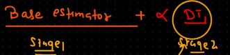
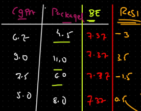

XGBoost, short for Extreme Gradient Boosting, is like a team of decision-making experts collaborating to solve a problem. Each expert (a weak learner) focuses on the mistakes made by the previous ones, gradually improving the team's performance. Here's a simplified breakdown:

1.Starting Point: Imagine you have a dataset and want to predict something, like whether an email is spam or not.

2.Initial Model: XGBoost starts with a simple model that makes rough predictions based on the available data.

3.Identifying Mistakes: The model looks at where it's making mistakes—where its predictions differ from the actual outcomes.

4.Building Teamwork: XGBoost adds more models (weak learners) to the team, each one specializing in correcting the mistakes of the previous models.

5.Combining Strengths: As more models join the team, XGBoost combines their predictions to make a final, more accurate prediction. It's like taking a vote among the experts.

6.Continuous Improvement: XGBoost repeats this process, with each new model focusing on the remaining mistakes, until the team's performance is optimized.

7.Final Prediction: When a new data point comes in, XGBoost combines the predictions from all the models to make a final prediction, leveraging the strengths of each model.

In essence, XGBoost is about teamwork and continuous improvement, leveraging the collective wisdom of multiple models to make accurate predictions.

Benefits:

Flexibility,Performance,Scalibilty,Robust to Outliers,missing value and Overfitting

It also handles numerical data as XG regressor and classification data as XG classifier
By default it uses Decison Tree as the algorithm

Final model formula= Base model+Eta*DT1 where Base modelor Base estimator(BE) is average.Here it average package
then in next cloumn we calculate Residual Residula=(Package-BE) which is input to Decision tree.

