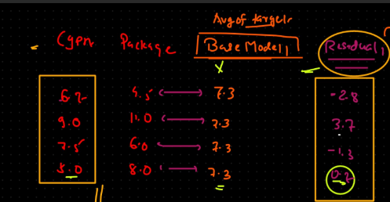

XGBoost, short for Extreme Gradient Boosting, is like a team of decision-making experts collaborating to solve a problem. Each expert (a weak learner) focuses on the mistakes made by the previous ones, gradually improving the team's performance. Here's a simplified breakdown:

1.Starting Point: Imagine you have a dataset and want to predict something, like whether an email is spam or not.

2.Initial Model: XGBoost starts with a simple model that makes rough predictions based on the available data.

3.Identifying Mistakes: The model looks at where it's making mistakes—where its predictions differ from the actual outcomes.

4.Building Teamwork: XGBoost adds more models (weak learners) to the team, each one specializing in correcting the mistakes of the previous models.

5.Combining Strengths: As more models join the team, XGBoost combines their predictions to make a final, more accurate prediction. It's like taking a vote among the experts.

6.Continuous Improvement: XGBoost repeats this process, with each new model focusing on the remaining mistakes, until the team's performance is optimized.

7.Final Prediction: When a new data point comes in, XGBoost combines the predictions from all the models to make a final prediction, leveraging the strengths of each model.

In essence, XGBoost is about teamwork and continuous improvement, leveraging the collective wisdom of multiple models to make accurate predictions.

Benefits:

Flexibility,Performance,Scalibilty,Robust to Outliers,missing value and Overfitting

It also handles numerical data as XG regressor and classification data as XG classifier
By default it uses Decison Tree as the algorithm

Final model formula= Base model+Eta*DT1 where Base model or Base estimator(BE) is average of Package.

Why Avegrage of Package? because this is the Target variable.We want to calculate package based on CGPA

then in next cloumn we calculate Residual Residulal=(Package-BE) which is input to Decision tree for stage

Now,In a decision tree, when deciding where to split the data at a node, we use INFO GAIN,similarly here we will use a decider known as SIMILARITY SCORE

Formula to calculate Similarity score:

where Alpha =0

here it is alfter calculation

Step2 :

Sort CGPA and then take average adjecent numbers.Now splitting will be done on these 3 values(5.85,7.1,8.25)

Splitting done and again we will calculate SIMILARITY SCORE of Left Node(LN) then Righ node (RN) then finally we will calculate GAIN

We will select the Node with highest GAIN value

Here we have selected node of CGPA 8.25 because this is having GAIN of 17.52 and we again follow the above steps and start splitting again

Final stage:

Model 2 means Prediction 2 .Here DT's Similarty score are (0.7,-2.05,3.7).For each CGPA we are predicting package here.Eg.for CGPA 6.7,since it is less than 8.25 hence it will come to left node of 5.85,here we will check if its true.Found out it is not true so it goes to right node of 5.58 whose similarity score -2.05

Calculation=Base model+ETA * DT1
           =7.37+(0.3)*(-2.05)
           =6.69

This is our 1st prediction 

similarly we can do it for all the other values which will be 8.41,6.69 and 7.51 

This is our final prediction.

We have not done any further split because there will single single values in each node and calculing SS score will not be significant.Max we can till depth=6,Here we went till depth=2 only which was sufficient

***Important thing to note here is In XGBoost, a decrease in residual (often referred to as "reduction in loss") signifies that the addition of a new tree in the ensemble has led to a better fit of the model to the training data.

Residuals: In the context of gradient boosting, residuals refer to the errors or the differences between the actual target values and the predicted values made by the current ensemble of trees.

